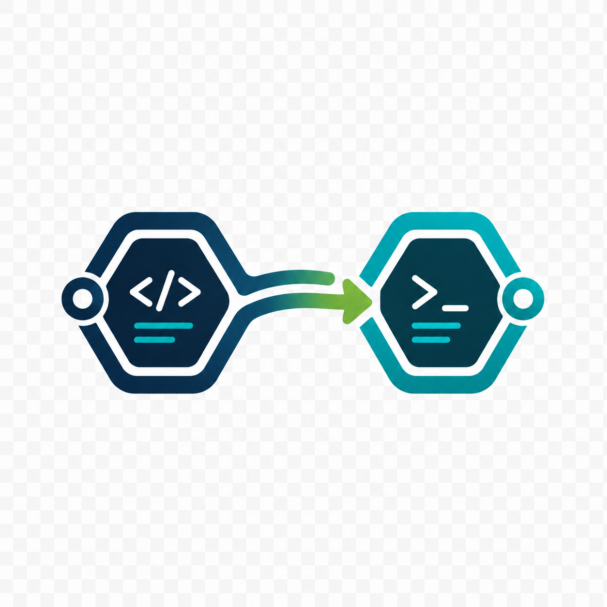

<p align="center">
  
</p>

# Cursor Coworker

Delegate bounded repository analysis or implementation to an authenticated Cursor Agent CLI and return a compact machine-readable result.

> Cursor Coworker is an independent community project and is not affiliated with or endorsed by Cursor.

## Why

Preserve the primary coding agent's context by moving context-heavy reading to an existing Cursor seat. Usage remains metered by Cursor; this project does not promise free or cheaper execution.

## Requirements

- Node.js 22+
- A current `cursor-agent` installation
- An authenticated Cursor account with headless use permitted by its policy

## Quick start

```bash
npx cursor-coworker doctor
npx cursor-coworker analyze --task "Explain the authentication flow with file evidence" --cwd "$PWD"
```

## Commands

`doctor` checks the local Cursor installation, login, and selected model. `analyze` performs read-only exploration. `run` writes directly to the selected directory. `instructions claude|codex` prints host guidance.

Both delegation commands accept `--cwd`, `--model`, `--timeout`, `--no-sandbox`, `--retain-transcript`, and `--cursor-path`. Use `--no-sandbox` only when the task cannot run inside Cursor's normal sandbox.

## Safety model

`analyze` is read-only. `run` writes directly to the selected directory. The caller owns Git isolation, concurrency, backups, verification, and review. Cursor Teams may have on-demand usage enabled. Raw transcript retention is opt-in and Cursor may separately retain its own session data.

## Output

```json
{"schemaVersion":1,"status":{"technical":"completed","task":"completed"},"summary":"Authentication enters through src/auth.ts.","evidence":[{"kind":"file","value":"src/auth.ts"}],"changes":{"available":false},"execution":{"mode":"analyze","requestedModel":"auto","durationMs":1200,"exitCode":0},"usage":{"state":"unknown"},"warnings":[]}
```

`status` separates process completion from task completion. `summary` and `evidence` are compact model output. `changes` reports Git observations. `execution` contains deterministic run metadata. `usage` is explicit when unavailable. `warnings` exposes safety caveats.

## Models and usage

`auto` is the default. `composer-2.5` is the only initial comparison model. Consult the current Cursor dashboard, plan documentation, and company policy for authoritative usage information.

## Host-agent instructions

```bash
cursor-coworker instructions claude
cursor-coworker instructions codex
```

The generated guidance is additive. It does not modify or replace Superpowers or the host's native subagents.

## Development

```bash
npm install
npm run check
```

Standard tests use a fake executable and make no billable Cursor calls.

## Experimental benchmark

The repository includes a local, sequential, read-only harness for comparing Cursor Auto, Cursor Composer 2.5, Claude Sonnet, and Claude Sonnet with native subagents. It requires a clean Git target and writes results under `.benchmark-results/` in the caller's current directory by default; `--output` can select another location.

```bash
# Cursor Auto and Composer 2.5
npm run benchmark:run -- --repo /path/to/repository

# Claude Sonnet, with and without subagents
npm run benchmark:run -- \
  --repo /path/to/repository \
  --providers claude-sonnet,claude-sonnet-subagents
```

Claude receives only read-only tools inside a fresh disposable clone. The subagent variant additionally receives the built-in `Agent` tool. See [docs/benchmark.md](docs/benchmark.md) for the protocol, options, safety constraints, and interpretation guidance.

### Initial results

An initial experiment used four generic repository-analysis cases with three repetitions on one private TypeScript service. Scores combine factual quality and evidence quality on a 0–5 rubric. The review was consistent but not independently blinded, so treat these numbers as directional rather than universal.

| Path | Quality | Median latency | Estimated usage value |
|---|---:|---:|---:|
| Cursor Auto | **4.83 / 5** | **68.6 s** | $2.13 |
| Cursor Composer 2.5 | 4.54 / 5 | 72.4 s | **$1.18** |
| Claude Sonnet | 3.83 / 5 | 101.9 s | $9.03 |
| Claude Sonnet + subagents | 4.08 / 5 | 69.8 s | $14.27 |

Cursor costs are reconstructed from the exported token events and Cursor's published per-million-token rates. Those events were marked `Included`, so their additional invoice cost was zero. Claude values come from Claude Code's `total_cost_usd` field and may likewise represent subscription usage rather than an additional charge. Claude subagent token counts were incomplete even when aggregate cost was present. The private repository, raw responses, and usage exports are intentionally not published.

The initial Claude experiment used unrestricted permissions inside disposable clones. Review showed that a clone is not an OS security boundary, so the published harness now uses the stricter read-only tool policy described above.

## License

MIT
